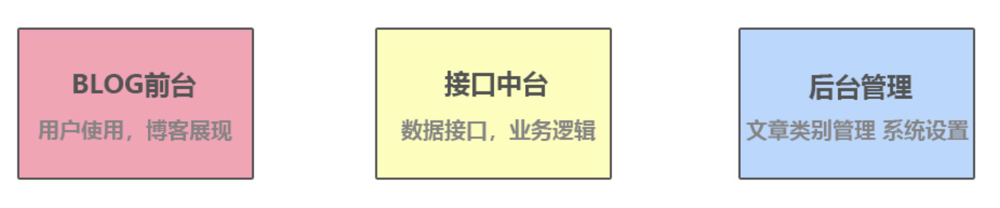

### build environment
- `create-next-app blog`
- 让Next支持CSS文件
```bash
# blog根目录下，新建一个next.config.js文件
const withCss = require('@zeit/next-css')

if(typeof require !== 'undefined'){
    require.extensions['.css']=file=>{}
}

module.exports = withCss({})
```
- 按需加载Ant Design
```bash
yarn add antd
yarn add babel-plugin-import
# 建立.babelrc
{
  "presets":["next/babel"],  //Next.js的总配置文件，相当于继承了它本身的所有配置
  "plugins":[     //增加新的插件，这个插件就是让antd可以按需引入，包括CSS
      [
          "import",
          {
              "libraryName":"antd"
          }
      ]
  ]
}

# 在pages目录下，新建一个_app.js文件，然后把CSS进行全局引入
import App from 'next/app'
import 'antd/dist/antd.css'
export default App

# index.js加入一个按钮，看看是否可以正常使用
```